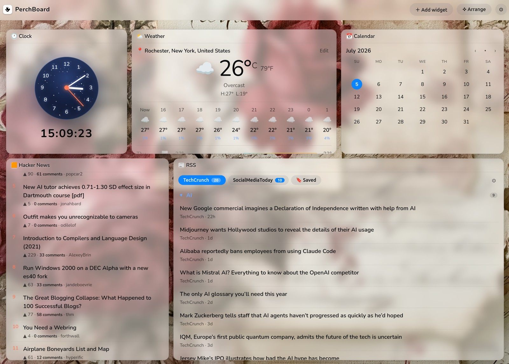
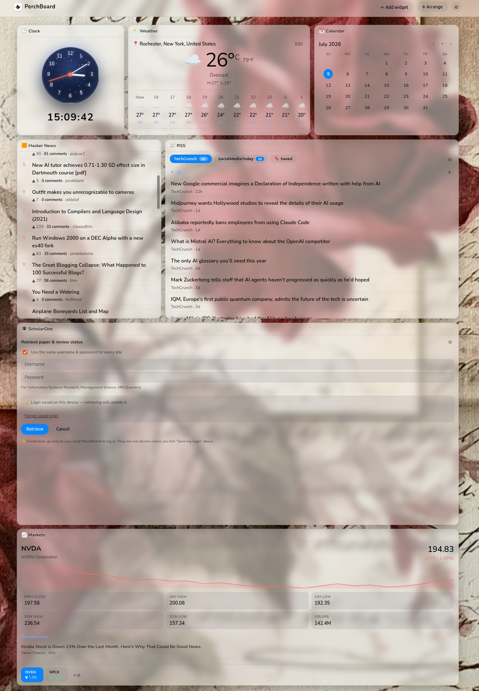

# PerchBoard

A personal, customizable home dashboard — inspired by
[Glance](https://github.com/glanceapp/glance), but trimmed down and tailored to
the widgets and interactions I actually want.

**Widgets:** Clock · Weather · RSS · Hacker News · Markets · Calendar · ScholarOne.

Everything is customized **in the UI** — no config files to edit. Add feeds and
tickers with a button, drag widgets around, drop in background photos (the text
auto-adjusts for contrast), and pick fonts/units.

## A look at it

A drag-and-arrange grid of glassy widgets over your own background photo:



Scroll down for the rest — here the ScholarOne submission/review retriever and an
expanded Markets view with an intraday chart, key stats, and related news:



---

# Getting started

There are two ways to run PerchBoard. Pick one:

- **Option A — Docker** (recommended): quick setup, runs anywhere, auto-starts on
  reboot. Best if you just want to *use* it.
- **Option B — Standalone**: build it from source and run the binary directly.
  Best if you want to hack on it or don't want Docker.

Both serve the dashboard at **http://localhost:7171**.

---

## Option A — Docker

### Step 1 — Install Docker

- **Windows / macOS:** download **Docker Desktop** from
  <https://www.docker.com/products/docker-desktop/> and install it. On Windows it
  runs on the **WSL 2** backend — the installer sets this up for you (accept the
  "Use WSL 2" option if asked; on older builds, enable WSL 2 first with
  `wsl --install` in an admin PowerShell, then reboot).
- **Linux (Ubuntu):** install Docker Engine following
  <https://docs.docker.com/engine/install/ubuntu/>.

### Step 2 — Make sure Docker is running

The shell examples below use `sudo` for Docker commands on Linux. With Docker
Desktop on Windows or macOS, omit `sudo`. Run commands one line at a time;
if a step fails, resolve it before continuing.

Run:

```bash
sudo docker info
```

- If you see a **`Server:`** section with details → Docker is running. ✅
- If you see `Cannot connect to the Docker daemon…` → start it:
  - Windows/macOS: open the **Docker Desktop** app and wait for "running".
  - Linux: `sudo systemctl enable --now docker` (this also makes it start on boot).

### Step 3 — Start PerchBoard

**Easiest (uses the prebuilt image — no download of source code):**

```bash
mkdir -p ~/perchboard
cd ~/perchboard
curl -sL https://raw.githubusercontent.com/Jacobsonradical/PerchBoard/main/docker-compose.yml -o docker-compose.yml
sudo docker compose up -d
```

That makes a folder `~/perchboard`, drops a `docker-compose.yml` into it, and
starts the container in the background.

> **On Windows with Docker Desktop:** use these commands in native
> **PowerShell** without `sudo`:
>
> ```powershell
> mkdir $HOME\perchboard
> cd $HOME\perchboard
> curl.exe -sL https://raw.githubusercontent.com/Jacobsonradical/PerchBoard/main/docker-compose.yml -o docker-compose.yml
> docker compose up -d
> ```
>
> (`curl.exe` is the real curl bundled with Windows 10/11 — plain `curl` in
> PowerShell is an alias for a different command, so the `.exe` matters here.)
> For the management and update commands below, also omit `sudo` when using
> Docker Desktop on Windows or macOS.

**Or build it yourself from source** (if the prebuilt image isn't available):

```bash
git clone https://github.com/Jacobsonradical/PerchBoard.git
cd PerchBoard
sudo docker build -t perchboard:latest .
sudo docker run -d --name perchboard --restart unless-stopped --dns 1.1.1.1 -p 127.0.0.1:7171:7171 -v perchboard-data:/data perchboard:latest
```

What the `sudo docker run` flags mean:
- `-d` — run in the background.
- `--name perchboard` — name it so it's easy to manage.
- `--restart unless-stopped` — **auto-start on every reboot** (see below).
- `-p 127.0.0.1:7171:7171` — serve it on your machine's port 7171, reachable
  from this machine only (not from other devices on your network). Drop the
  `127.0.0.1:` prefix only if you deliberately want to open it to your LAN.
- `--dns 1.1.1.1` — use Cloudflare DNS instead of inheriting host/VPN DNS; substitute a reachable resolver if your network requires one.
- `-v perchboard-data:/data` — save your dashboard + backgrounds in a volume so
  they survive restarts and updates. This is a Docker-managed **named volume**, so
  it works the same on Windows, macOS, and Linux — there are no host folder paths
  to translate (nothing like `C:\...` to get right).

The Compose file and Docker run examples use Cloudflare DNS (`1.1.1.1`) for PerchBoard. If your network
requires a different resolver, change the service's `dns` entry to a reachable
server. Errors such as `lookup … on 127.0.0.11:53: server misbehaving` indicate
Docker DNS failure and can affect feeds, weather, markets, readers and summaries
at once. Check resolution inside the container:

```bash
sudo docker exec perchboard nslookup hacker-news.firebaseio.com
sudo docker exec perchboard nslookup hacker-news.firebaseio.com 1.1.1.1
```

After changing `dns` in your deployed Compose file, run this from its existing
folder to recreate only PerchBoard with the new settings and retain its named volume:

```bash
sudo docker compose up -d --force-recreate --no-deps perchboard
```

### Step 4 — Open it

Go to **http://localhost:7171** in your browser.

### Managing it

```bash
sudo docker ps                  # is it running? look for "perchboard"
sudo docker logs -f perchboard   # view logs (Ctrl+C to stop watching)
sudo docker stop perchboard      # stop
sudo docker start perchboard     # start again
sudo docker rm -f perchboard     # remove the container (your data stays in the volume)
```

### Auto-start on reboot

Two things make this work, and both are already handled above:
1. The Docker service starts on boot — `sudo systemctl enable --now docker` (Linux),
   or enable "Start Docker Desktop when you log in" in Docker Desktop settings.
2. The container has a restart policy — `--restart unless-stopped` (the
   `sudo docker run` above) or `restart: unless-stopped` (the compose file).

After a reboot, check with `sudo docker ps` — it should already be `Up`.

### Updating later

```bash
# prebuilt-image method:
cd ~/perchboard
sudo docker compose pull
sudo docker compose up -d

# from-source method:
cd PerchBoard
git pull
sudo docker build -t perchboard:latest .
sudo docker rm -f perchboard
sudo docker run -d --name perchboard --restart unless-stopped --dns 1.1.1.1 -p 127.0.0.1:7171:7171 -v perchboard-data:/data perchboard:latest
```

Your config and backgrounds live in the `perchboard-data` volume, so they
survive updates.

---

## Option B — Standalone (build from source)

### Step 1 — Install the tools

You need **Go ≥ 1.25** and **Node.js ≥ 20**.

- **Go:** download from <https://go.dev/dl/> (or `sudo apt install golang-go` on
  recent Ubuntu — check `go version` is ≥ 1.25).
- **Node.js:** download from <https://nodejs.org/> (or use
  [nvm](https://github.com/nvm-sh/nvm): `nvm install 20`).

Verify:

```bash
go version     # should print go1.25 or newer
node --version # should print v20 or newer
```

### Step 2 — Get the code

```bash
git clone https://github.com/Jacobsonradical/PerchBoard.git
cd PerchBoard
```

### Step 3 — Build

```bash
make build
```

This installs the frontend dependencies, builds the web UI, and compiles
everything into a single program called `perchboard` in the current folder.

### Step 4 — Run

```bash
./perchboard                       # opens in Firefox (default)
./perchboard --browser chrome-app  # chromeless app-style window instead
./perchboard --serve               # just serve; open http://localhost:7171 yourself
```

`--browser` accepts `firefox` | `chrome-app` | `default` | `auto`.

Your settings are saved to `~/.config/perchboard/` (override with the
`PERCHBOARD_DATA` environment variable).

---

# Using the dashboard

- **＋ Add widget** — pick any component; it drops onto the grid.
- **✥ Arrange** — drag widgets by their header, resize from the corner, rename
  inline, or remove. The layout saves automatically.
- **⚙ Settings** — choose a font and text size, upload background photos
  (static or shuffle), and enable OS notifications.
- **RSS** — add feed URLs and optional "filter words". A filter word (e.g. `AI`)
  splits the feed into an `AI` category and `Other` by title; categories collapse.
  Set the max length, click ✕ to permanently ignore an item, read items dim, and
  new items raise a notification.
- **RSS article opening** — each feed has independent **Archive.today** and
  **PerchBoard reader** checkboxes, available when adding or editing a feed.
  Leave both off to open the original website (unless AI summary is enabled).
  Enable both to try PerchBoard
  first and open Archive.today directly in your browser if extraction fails.
  A separate reading page names the active service and announces the handoff
  before leaving PerchBoard when summaries are off. In that mode, Archive.today
  is not fetched through our server;
  its page shows the available snapshot or its own error, and PerchBoard cannot
  verify that result across sites. This also applies to Saved articles.
  PerchBoard preserves available headings, images, captions, lists, quotations,
  links, author and date in a readable article layout. It extracts content
  returned by the publisher and cannot guarantee a complete article. Original
  links remain available. Article content is not saved to the dashboard.
  See [tested publishers and limitations](#article-reader-compatibility) for
  the current evidence behind publisher support.
- **AI article summary** — in **Settings → AI article summary**, choose Claude
  or OpenAI / GPT and enter your model ID and API key. These settings are
  separate from smart filtering. Enable **AI summary** for individual feeds
  under RSS feed settings; it also applies to Saved articles. Enabled articles
  open in PerchBoard, with a floating, closable card above the article containing
  two or three sentences in the article's language: what happened, who is
  involved, and the main outcome or conclusion. Use **Show AI summary** to
  reopen the card without another request.
  Summaries use extracted article text, which is sent to the selected provider
  when you open an enabled article; API charges may apply. The summary key is
  stored server-side in its own owner-readable file and is never returned by
  the configuration API. Successful summaries are cached in server memory for
  up to one hour (up to 128 entries); changing the model, key or article text
  causes a new request. When local extraction fails and Archive.today is selected,
  PerchBoard keeps the summary tab open and tries retrieving the archived text.
  Use **Read on Archive.today in another tab** to open the snapshot separately.
  If automated retrieval is blocked, paste the article body into the summary
  panel and click **Summarize pasted text**. Pasted text is sent to your configured
  provider only on submission, stays out of dashboard storage, and is labeled as
  the summary's source. It must contain 600–60,000 characters. Use **Replace pasted
  text** to correct the input. No summary is generated without article text or
  when text exceeds the single-request limit of 60,000 characters. AI summaries may
  contain errors and cannot guarantee that the extracted article is complete.
  Original and selected Archive links remain available; PerchBoard cannot
  insert its summary card into those external pages.
- **Weather** — auto-detects your location (or search a place); shows the current
  temperature in both °C and °F, an hourly strip, and a past+future daily forecast
  with wind, rain %, and sunrise/sunset.
- **Markets** — one tab per ticker; each shows price, an interactive intraday
  chart (hover for price + time), key stats, and company-specific news. Add a
  stock by searching its name (e.g. "Nvidia" → NVDA).
- **Clock** — an analog dial set in a starfield, with the live digital time.
- **ScholarOne** — check your paper (Author) and review (Reviewer) status across
  ScholarOne journal sites (e.g. ISR, Management Science, MIS Quarterly) without
  logging into each one by hand. Enter your login(s) — one set for all sites or
  per-site — and PerchBoard drives a headless browser locally to read each
  dashboard, then groups the results per journal with a Paper/Review toggle.
  Credentials are used once and never stored. Needs Chrome/Chromium installed
  (the Docker image bundles Chromium).

## Article reader compatibility

The reader can sometimes extract text from pages that display a paywall, but
it is not a universal paywall bypass. RSS availability does not mean that
article text is accessible.

**Tested September 11, 2026:** 60 article/page samples across 28 publishers,
plus homepage or RSS checks for four more. The table describes the
**PerchBoard reader**, not Archive.today. Counts show saved responses that
yielded substantial text after extraction fixes; they are not ongoing success
rates or proof of complete articles.

- **Higher confidence:** extraction succeeded and a final live app check also
  succeeded. Coverage is still limited to the sampled articles.
- **Promising:** saved responses were extractable, but the publisher was not
  included in the final live app check.
- **Mixed / limited:** access was inconsistent, page types differed, or the
  usable sample was particularly limited.
- **Not successful:** none of the sampled pages yielded readable articles.
- **Not established:** only homepage or RSS access was checked; no article
  sample was obtained.

| Publisher | Assessment | Extractable samples | Evidence / limitations |
|---|---|---:|---|
| BBC | Promising | 2/2 | Both saved article responses were extractable. |
| The Guardian | Higher confidence | 2/2 | One article also passed the final live check. |
| NPR | Higher confidence | 2/2 | One article also passed the final live check. |
| CNN | Higher confidence | 2/2 | Both articles also passed the final live check. |
| Fox News | Promising | 2/2 | Both saved article responses were extractable. |
| ABC News | Mixed / limited | 1/2 | Ordinary article worked; live coverage is unsupported. |
| CBS News | Promising | 2/2 | Both saved article responses were extractable. |
| NBC News | Promising | 2/2 | Both saved article responses were extractable. |
| CNBC | Promising | 2/2 | Both saved article responses were extractable. |
| Financial Times | Not successful | 0/2 | Both requests returned HTTP 403. |
| The Wall Street Journal | Not successful | 0/2 | Both requests returned HTTP 401; a later recheck had the same result. |
| Bloomberg | Not successful | 0/2 | Both requests returned HTTP 403. |
| The Atlantic | Promising | 2/2 | Both saved article responses were extractable. |
| The Economist | Not successful | 0/2 | Both requests returned HTTP 403. |
| Politico | Not successful | 0/2 | Both requests returned HTTP 403. |
| Al Jazeera | Promising | 2/2 | Both saved article responses were extractable. |
| The New York Times | Mixed / limited | 2/2 | Saved responses worked, but the final live request returned HTTP 403. |
| The Washington Post | Mixed / limited | 1/3 | Ordinary news article also passed live; two reader-callout pages lacked substantial text. |
| WIRED | Mixed / limited | 2/2 | Includes a discount-code page, so ordinary news coverage is limited. |
| TechCrunch | Mixed / limited | 1/2 | One article worked; the other URL returned HTTP 404. |
| Reuters | Not established | — | Homepage/directory returned HTTP 401; no article sample. |
| Associated Press | Not successful | 0/2 | Both requests returned HTTP 403. |
| USA Today | Mixed / limited | 3/4 | Two news articles and a shopping page worked; live coverage is unsupported. |
| Los Angeles Times | Higher confidence | 2/4 | Two articles worked, including one live recheck; two collection pages were rejected. |
| The Boston Globe | Promising | 2/2 | Both saved article responses were extractable. |
| The Telegraph | Not established | — | Homepage returned HTTP 402 and RSS returned HTTP 403; no article sample. |
| The Times (UK) | Not successful | 0/2 | One unsupported live page and one subscription preview. |
| South China Morning Post | Higher confidence | 2/2 | Both articles also passed the final live check. |
| CBC | Higher confidence | 1/1 | Also passed live, but only one article was sampled. |
| DW | Promising | 2/2 | Both saved article responses were extractable. |
| France 24 | Not established | — | RSS returned HTTP 403; no confirmed article sample from the homepage. |
| Axios | Not established | — | Homepage and RSS returned HTTP 403; no article sample. |

Overall, 39 of the 60 saved responses were extractable. A separate final live
check succeeded on nine of ten requests across eight publishers; the failed
request was to The New York Times. HTTP 401/403 results describe requests from
the test environment, not whether you can read the same page in your browser.
Publisher changes, network conditions and article formats can change results.
Live coverage, collections, videos and interactive elements are not covered
by a successful ordinary-text extraction result.

**Archive.today fallback:** enabling both services tries PerchBoard first,
then opens Archive.today in your browser if extraction fails. With AI summaries
enabled, PerchBoard stays open, attempts archive extraction, and offers a separate
Archive tab plus pasted-text summarization if needed. A successful
redirect only means the handoff worked; it does not confirm that a readable
snapshot exists. These tests do not establish per-publisher Archive coverage.
If Archive.today also cannot provide a readable copy, the selected services
cannot read that article; the original link remains available.

---

# How it works

A single Go binary serves a small REST API **and** the embedded React app, so
there's nothing else to install. It runs three ways: a standalone window, a plain
web app (`--serve`), or in Docker.

- **Backend:** Go. Uses only **key-free** data sources so anyone can run it:
  Open-Meteo (weather + geocoding), Hacker News API, Yahoo Finance (quotes,
  news, symbol search), ipapi (IP geolocation), and any RSS/Atom feed.
- **Frontend:** React + Vite, `react-grid-layout` for drag/resize.
- **Persistence:** the whole dashboard is one JSON document the backend stores
  verbatim (`config.json`); backgrounds are saved as files. Both live in
  `~/.config/perchboard/`, or `/data` inside Docker.

```
main.go            entry: starts the server, opens the window/browser
launch.go          standalone window (Firefox by default; chrome-app for a chromeless window)
internal/server/   HTTP routes (data APIs, config, background upload, static SPA)
internal/feeds/    upstream integrations (rss, hn, weather, markets, news, geo) + cache
internal/config/   on-disk paths + atomic config save
web/               React frontend (built into web/dist, embedded into the binary)
```

### Development (hot reload)

```bash
make dev-api   # Go backend on :7171
make dev-web   # Vite dev server on :5173 (proxies /api to the backend)
```

---

# Notes & limitations

- **Notifications** are a browser feature, so they only fire while the page is
  open (a background tab is fine). They don't fire with the browser fully closed.
  On `http://localhost` they work after you click "allow".
- **Calendar** is a local month view (clickable days); Google Calendar sync is a
  planned follow-up.
- A **Reddit** widget was originally planned but removed — Reddit shut down
  unauthenticated access to its public JSON (HTTP 403).
- The standalone window opens a browser (Firefox by default) rather than an
  embedded webview, because the common Go webview binding needs `webkit2gtk-4.0`,
  which Ubuntu 24.04 replaced with `4.1`.
